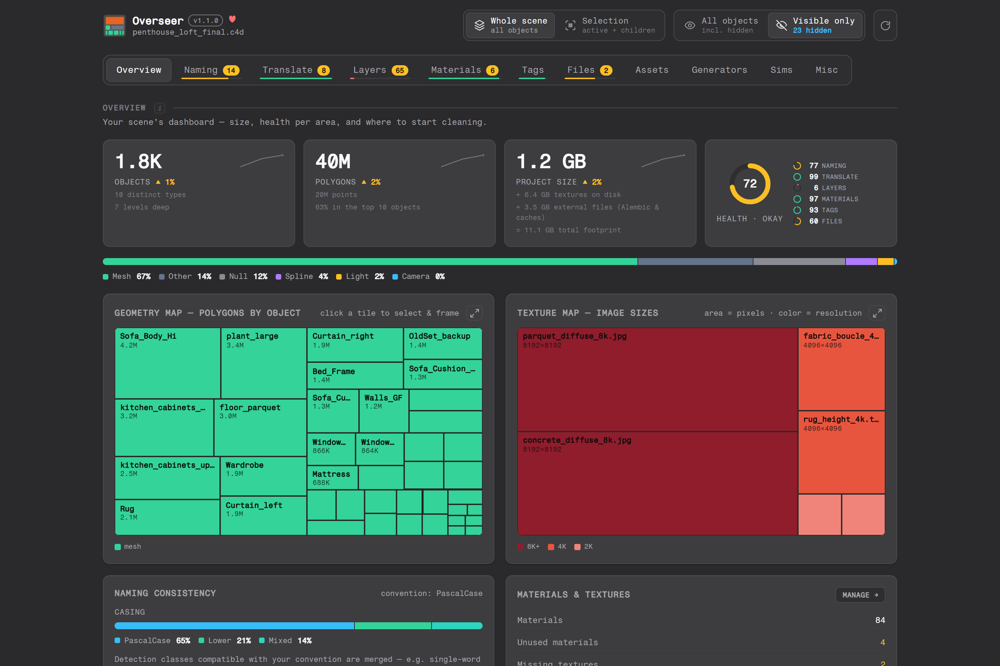

<!--
  Generated in a fixed, reproducible style — see .claude/skills/readme/SKILL.md.
  Detailed per-tab features live in docs/FEATURES.md; screenshots in
  docs/screenshots/ are regenerated from sample data.
-->

# Overseer

**Keep your 3D scenes organized — clean names, tidy structure, no
dead weight. One tool, one web UI, on Cinema 4D and Blender.**

[](https://www.youtube.com/watch?v=jsoKxY_QdG0)
[](https://github.com/lukasguziel/overseer/releases/latest)
[](docs/FEATURES.md)
[](https://www.maxon.net/cinema-4d)
[](https://www.blender.org)
[](https://www.paypal.com/donate/?hosted_button_id=XSBBJYYEJZ7TE)
[](mailto:bamerus@proton.me)

[](https://www.youtube.com/watch?v=jsoKxY_QdG0)

Overseer is a scene-organization tool for **Cinema 4D and Blender** — the same
web UI and the same features on both host applications. It analyzes your scene
and helps you keep it in shape: consistent object names, translated wording,
layers (Cinema 4D layers / Blender collections), object attachments, generator
and simulation settings, external files, and materials & textures without
leftovers. Every change is previewed first, applied per row or in bulk,
undoable, and logged — so batch cleanup stops being scary. Your settings persist
per project.



## What it does

Full feature tour with screenshots: **[docs/FEATURES.md](docs/FEATURES.md)**

- **Overview** — dashboard with per-area health scores, size trends, a
  polygon treemap and a texture budget.
- **Naming** — normalizes names to your convention (casing, numbering,
  duplicates, kept special characters) with a live preview.
- **Translate** — rewrites names into your target language, via Google or
  offline dictionaries, with real source-language detection.
- **Layers** — organizes objects into layers (Cinema 4D) or collections
  (Blender): gives every unassigned object one, single or in a batch, and
  recolors the whole stack with an editable gradient — without moving anything.
- **Materials** — finds unused materials, oversized textures and missing
  maps — relink via file dialog, copy into the project, shrink in place, or
  clear dead refs.
- **Tags** — audits every object attachment (Cinema 4D tags; Blender
  modifiers, constraints & shading): missing smoothing, duplicate material
  assignments, angle spread with one-click alignment, and a grouped inventory.
- **Files** — inventory of external references (Alembic, caches, IES,
  audio/video, linked libraries) with missing-file relink and accept.
- **Assets** — searchable, sortable object inventory with batch actions
  (assign layer, move to group).
- **Generators** — compares settings across same-type generators (Cinema 4D)
  or modifiers (Blender, e.g. Subdivision Surface) and aligns them in one
  undoable step.
- **Sims** — finds simulation setups that cost you silently: active on
  hidden objects, unbaked, or disabled leftovers.
- **Misc** — change history with revert, analysis history per scene, and a
  profile to hide the areas you don't use.

## Installation

One codebase, two hosts — the same web UI and features on both. Each
[release](https://github.com/lukasguziel/overseer/releases) ships both builds.

**Cinema 4D** (2023+)
1. Grab the latest **`Overseer-Cinema4D-<version>.zip`**.
2. Unzip and copy the `Overseer` folder into your Cinema 4D `plugins` folder.
3. Restart Cinema 4D, then press `Shift+C` and search for **"Overseer"**.

**Blender** (4.2 LTS+)
1. Grab the latest **`Overseer-Blender-<version>.zip`**.
2. *Edit → Preferences → Add-ons → Install…*, pick the zip, enable **Overseer**.
3. Open it from the 3D Viewport sidebar (**N**) → **Overseer** tab.

## License

Overseer is free to use for personal and commercial projects, and you may
modify it for your own use. Selling it, bundling it into paid products, or
redistributing it as your own work is not permitted — see [LICENSE](LICENSE).

## Development

One codebase, two hosts. The pure domain logic and the web UI are shared; each
host is a thin adapter that implements a common set of ports
([docs/ai/hostapi.md](docs/ai/hostapi.md)), so a third 3D application is a
per-area checklist away. Nothing under `src/overseer/core`, `naming` or the
frontend imports a host SDK, so the test suite runs without Cinema 4D or
Blender:

```bash
python -m pytest                 # unit tests (no c4d / bpy)
python -m ruff check src tests   # lint
cd frontend && pnpm run build    # web UI -> src/web/
powershell -File .claude/skills/deploy/deploy.ps1          # -> a Cinema 4D plugin dir
powershell -File .claude/skills/deploy/deploy_blender.ps1  # -> a Blender addon dir
```

`main` is the protected release branch: every merge into it rebuilds both the
Cinema 4D and the Blender package and refreshes the release of the version
stamped in the repo. All work happens on `feature/<topic>` branches; changes
land via pull request. Architecture, conventions and module docs:
[AGENTS.md](AGENTS.md) and [docs/](docs/).

## Feedback

Bugs, feature requests, questions, ideas, or just what you built with it —
anything goes to any of these:

- [GitHub Issues](https://github.com/lukasguziel/overseer/issues)
- [X DM @LukasGuziel](https://x.com/LukasGuziel)
- [bamerus@proton.me](mailto:bamerus@proton.me)
