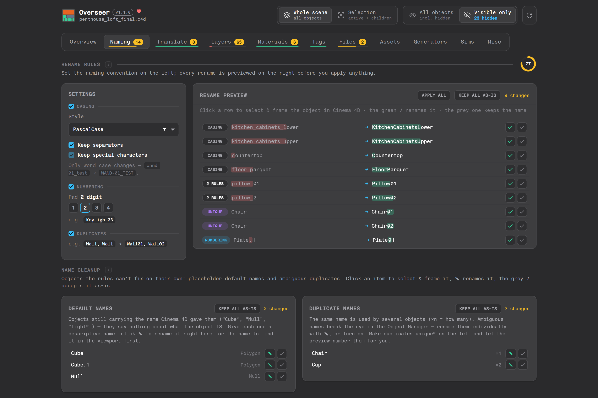
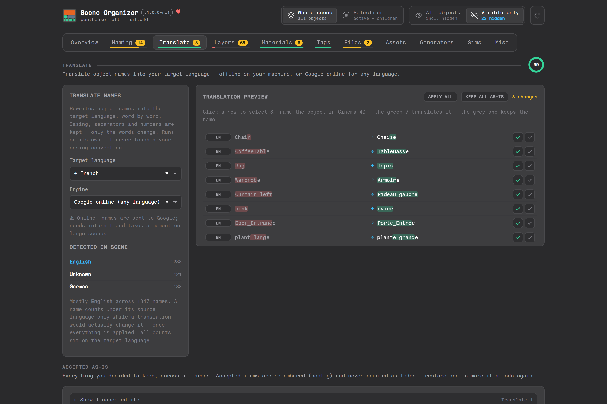
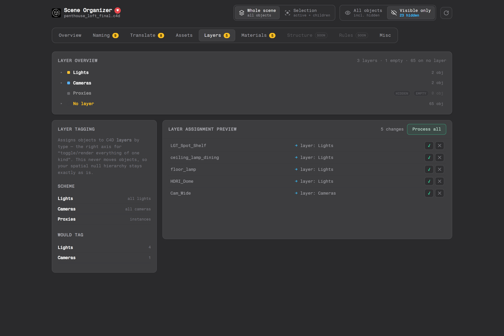
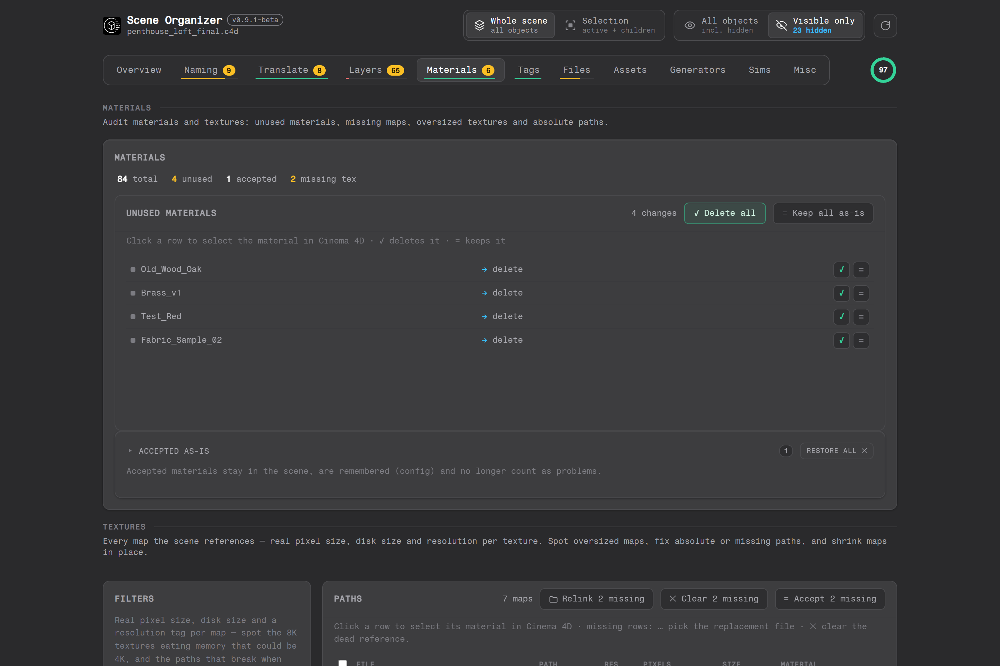
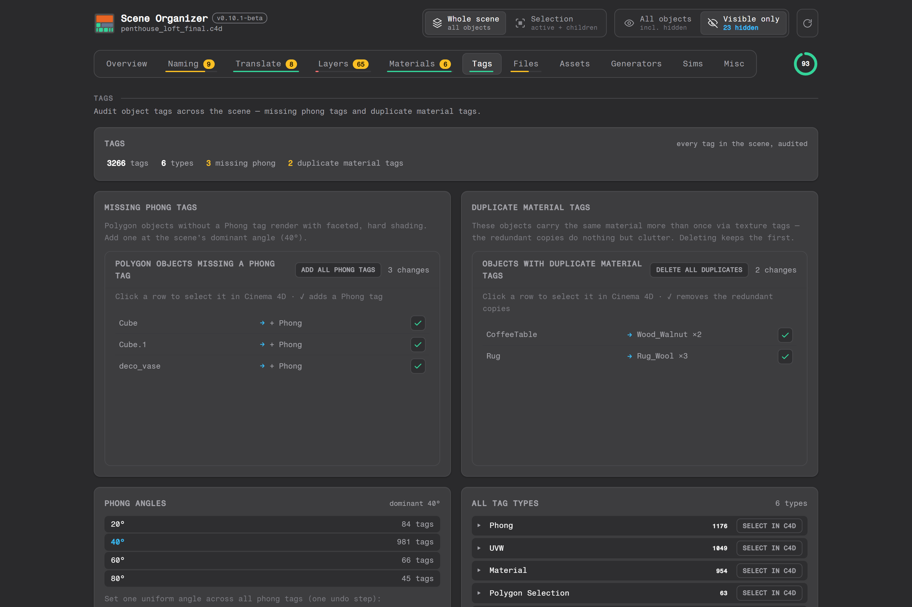
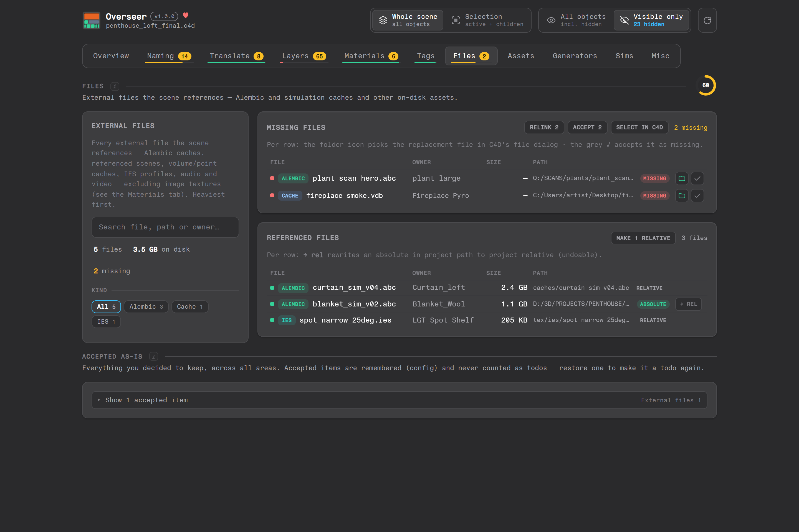
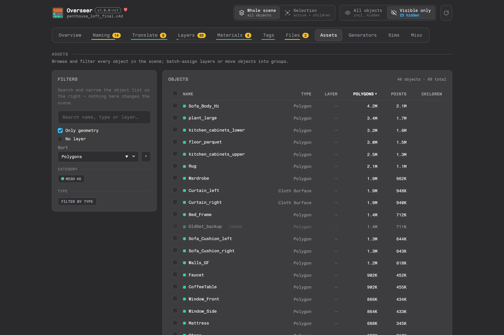
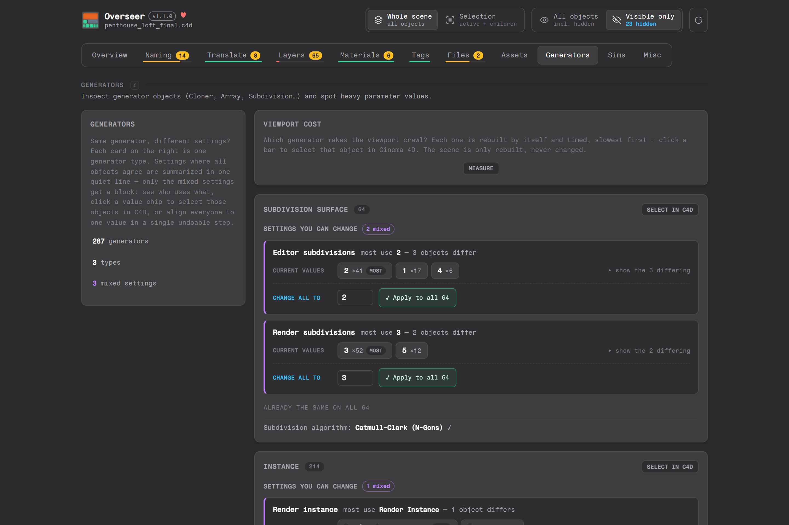
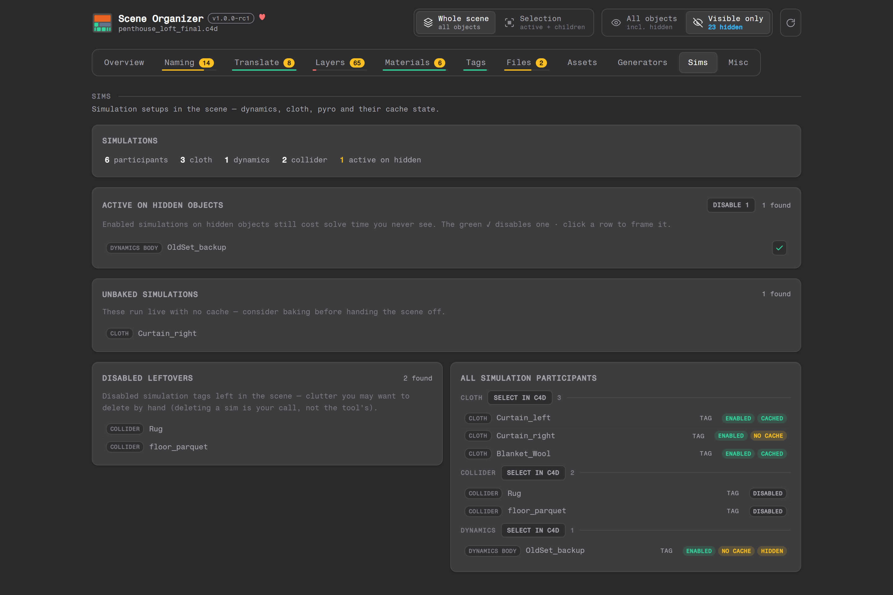
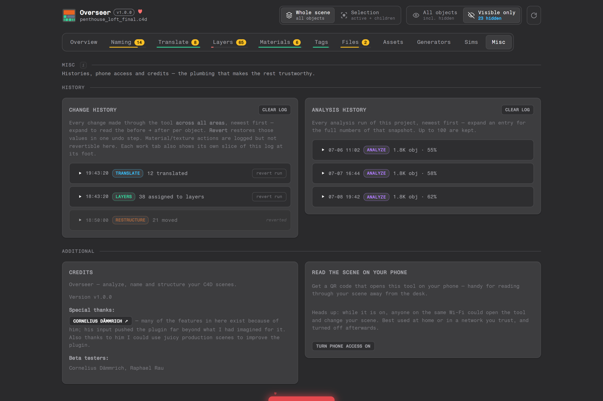

<!--
  Generated in a fixed, reproducible style — see .claude/skills/readme/SKILL.md.
  Section format: heading -> screenshot -> feature checklist.
  Screenshots live in docs/screenshots/ and are regenerated from sample data.
-->

# Features

Every area of the Overseer web UI in detail. All changes across the
tool follow the same workflow: **preview first**, accept or skip per row,
batch actions always confirm with the exact count, apply as one undo step,
and everything is logged in the change history. Every clickable setting is
saved per project and restored when you reopen it; presets carry your
convention across projects.

## Overview

Your scene's dashboard: how big, how healthy, and where to start.

- ✅ **Key tiles with trends** — objects (distinct types, hierarchy depth),
  polygons (points, top-10 share) and project size with sparkline and delta
  from your analysis history.
- ✅ **Total footprint** — project file + textures on disk + external files
  (Alembic & caches) summed into the number you'd actually hand off.
- ✅ **Health score with sub-rings** — naming, translate, layers, materials,
  tags and files each get a percentage; the rings jump straight to the
  matching tab, and every scored tab carries a progress underline in the
  navigation.
- ✅ **Geometry treemap** — every object sized by polygon count; click a tile
  to select & frame it in the viewport and find the heaviest assets in
  seconds.
- ✅ **Texture budget** — resolution mix (8K/4K/2K), estimated uncompressed
  RAM/VRAM cost and the heaviest maps, clickable.
- ✅ **Naming consistency** — convention-aware casing distribution and the
  language mix, taken verbatim from the Translate engine.

## Naming

Normalizes object names to **your** convention — casing, numbering,
duplicates — without ever touching the words themselves.

- ✅ **Live rename preview** — every proposed rename as `old → new`, tagged
  with the rule that caused it (casing / numbering / unique).
- ✅ **Per-row apply ✓ / accept-as-is =** — apply one rename immediately
  (undoable) or accept the current name; accepted names are remembered in
  the config and stop counting as todos. Click a row to select & frame the
  object first.
- ✅ **Producible casings** — PascalCase, camelCase, lower_snake, UPPER_SNAKE,
  kebab; auto-detected from the scene's dominant style.
- ✅ **Keep separators & special characters** — recases words but keeps your
  `-`/`_` conventions, and `[test]` stays `[Test]` instead of losing its
  brackets (both on by default, both optional).
- ✅ **Numbering & dedupe** — configurable zero-padding (01/001/…), duplicate
  names become unique (`Wall, Wall → Wall01, Wall02`).
- ✅ **Name cleanup lists** — default names (`Cube`, `Null`) and duplicates
  with inline rename, per-row accept and a slim keep-all per bucket.

## Translate

Rewrites object names into a target language, word by word — casing,
separators and numbers survive.

- ✅ **Google engine by default** — any language pair, with real per-name
  source-language detection and a persistent cache, so re-plans and apply
  are instant and only new names go online.
- ✅ **Offline dictionaries** — DE/FR/ES/IT/NL/PL/CS/PT/RU/TR → English (and
  back for German) when no data may leave the machine.
- ✅ **Honest language panel** — names count under their source language only
  while a translation would change them; once everything is applied the
  panel agrees with the empty todo list.
- ✅ **Word-level diff** — `Door_Entrance → Porte_Entree` with the exact word
  mapping in the tooltip, so you can verify the translation before applying.
- ✅ **Per-row apply / accept-as-is** — the same uniform workflow as every
  other tab.

## Layers

One job: every object that should live on a layer gets one — **without
moving a single object**.

- ✅ **Layer overview tree** — every layer with color, object count, polygon
  count and V/R/L flags, expandable down to the objects.
- ✅ **Color gradient** — "Edit gradient" puts a vertical multi-stop color
  bar next to the layer list: click to add colors in between, drag stops to
  move them, and every layer row previews its resulting color live. Cancel
  restores everything; "Set gradient" recolors all layers in one undoable
  step.
- ✅ **No-layer worklist** — every layerless object in one list; assign via
  inline picker (existing layers autocomplete, new ones are created), or
  accept "fine without a layer" per row.
- ✅ **Batch assign** — type one layer name and give it to the whole list in
  a single undoable step, confirmation included.
- ✅ **Suggested layers** — objects whose ancestors already sit on a layer
  get that layer proposed; assign all suggestions in one confirmed step.
- ✅ **Empty-layer cleanup** — layers nothing references can be deleted in
  one undoable step, or accepted and kept.
- ✅ **Never touches the hierarchy** — layers are orthogonal to your spatial
  null structure; this tool keeps it that way.

## Materials

Materials and the textures behind them — the invisible half of a scene's
size.

- ✅ **Scope-aware unused detection** — "Visible only" lists materials used
  nowhere; "All objects" adds the ones used exclusively by hidden objects,
  badged and deletable at your own call. Anything a visible object uses
  never shows up.
- ✅ **Bulk delete with confirmation** — remove all deletable materials in
  one undoable step; intentional keepers are accepted and remembered.
- ✅ **One paths workbench** — filter every map by path status (absolute /
  relative / missing) and resolution tier; each row carries its status
  badge, and thumbnails open the image in your picture viewer.
- ✅ **Missing textures are actionable** — per row: pick the replacement in
  C4D's native file dialog, clear the dead reference, or accept the map as
  missing; in batch: relink from a search folder or clear all. Works across
  Octane/Redshift node setups.
- ✅ **Shrink maps in place** — an oversized map gets a smaller copy at the
  percentage you pick and the materials are relinked to it; the row notes
  what it was resized from.
- ✅ **Path fixes** — rewrite absolute in-project paths to relative, or copy
  out-of-project files into `tex/` and relink — in batch or per map, with
  the affected materials listed before you confirm.

## Tags

Every tag in the scene, audited — the fastest way to catch shading setup
drift.

- ✅ **Missing Phong tags** — polygon objects without one render faceted;
  add per row or all at once, at the scene's dominant angle.
- ✅ **Duplicate material tags** — the same material assigned twice on one
  object is clutter; delete the redundant copies, the first stays.
- ✅ **Phong angle spread** — the distribution across the scene (84× 20°,
  981× 40°, …) and a one-click uniform angle for all phong tags.
- ✅ **Full tag inventory** — every tag type with count, expandable to the
  carrying objects, and "Select in C4D" per type. Each object is one row —
  several tags of a type show as chips on it, not as duplicate rows.
- ✅ **Selection tags unified** — point, polygon and edge selections appear
  as ONE "Selection" entry; every tag chip carries a point/poly/edge badge,
  and select-in-C4D covers all three kinds.
- ✅ **Only tags you can see** — data tags that never show in the Object
  Manager (per-geometry payloads) are filtered out of the audit.
- ✅ **Feeds the health score** — missing phong + duplicate tags count as
  defects.

## Files

Every external file the scene references — Alembic caches, volume/point
caches, IES profiles, audio, video — excluding image textures (those live
in Materials).

- ✅ **Inventory with kind filter** — chips per kind with counts, sorted by
  size, per-row focus of the referencing object.
- ✅ **Search** — one query narrows both lists by file name, stored path or
  owner; the kind chips stack on top of it.
- ✅ **Missing files are actionable** — per row: pick the replacement in
  C4D's native file dialog or accept the file as missing; in batch: relink
  from a search folder, select all owners in C4D, or accept all.
- ✅ **Accepted-as-missing list** — remembered in the config, restorable,
  and reflected in the Files health score.
- ✅ **Make relative** — absolute paths under the project folder rewritten
  to project-relative, any kind: per row with **→ rel**, or all at once
  from the list header (one undoable step).

## Assets

A searchable, sortable inventory of every object in the scene — and a batch
tool, not just a list.

- ✅ **Search + facets** — filter by name/type/layer text, category chips
  (mesh/light/camera/…), per-type facets, "only geometry" and "no layer"
  toggles.
- ✅ **Sortable columns** — polygons, points, children, name, layer; find the
  heaviest objects instantly.
- ✅ **Multi-select with batch actions** — check rows, then *assign to layer*
  or *move to group* (targets autocomplete from the scene, created if
  missing, one undo step).
- ✅ **Click to focus** — any row selects & frames the object in the viewport.
- ✅ **Hidden-object awareness** — objects hidden in the Object Manager are
  marked and can be excluded from all stats.

## Generators

Same generator, different settings? One card per type shows exactly where
objects disagree — with the real C4D icons and C4D's own value labels.

- ✅ **Mixed settings only** — settings everyone agrees on collapse into one
  quiet line; only real spread gets a block: "most use 2 — 3 objects
  differ".
- ✅ **Current values as neutral chips** — value × count, the dominant one
  tagged MOST; clicking a chip selects those objects in C4D.
- ✅ **Change all to …** — one clearly separated control per setting; align
  every object in a single undoable step, or fix the differing ones per
  row.
- ✅ **Audited types** — Subdivision Surface (editor/render subdivisions,
  algorithm), Instance render mode, Cloner, Extrude, Symmetry.

## Sims

Finds the simulation setups that cost you silently.

- ✅ **Active on hidden objects** — enabled sims on hidden geometry burn
  solve time you never see; disable per row or all at once.
- ✅ **Unbaked simulations** — live sims without a cache, flagged before you
  hand the scene off.
- ✅ **Disabled leftovers** — dead sim tags listed as cleanup candidates
  (deleting stays your call).
- ✅ **Full roster** — every participant (cloth, dynamics, colliders, pyro,
  particles, hair) with enabled/cached/hidden badges and per-kind
  select-in-C4D.

## Misc

History — the plumbing that makes the rest trustworthy.

- ✅ **Change history with revert** — every tool action is logged with
  before → after per object; one click restores the previous state (again
  undoable).
- ✅ **Analysis history** — object/polygon/size/compliance over time feeds
  the Overview trends.
- ✅ **Read the scene on your phone** — a QR code opens the tool on your
  phone for reading through the scene away from the desk; opt-in, and best
  turned off again afterwards.
